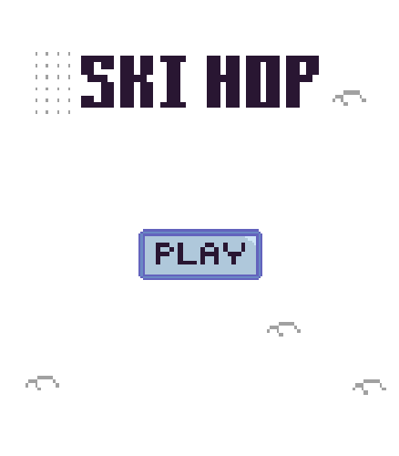
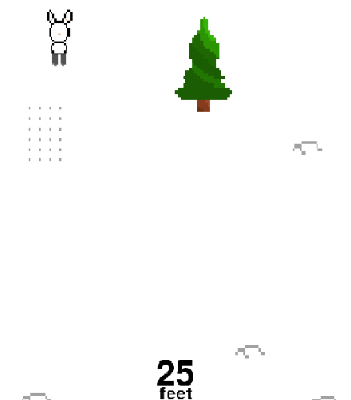

# SKI HOP

This game was created as a mini-project by `msardina`.
Ski hop is a fun simple game about a little cute bunny going down a fun mountain in Niseko (Japan).
Have fun and enjoy! :D

- Assume release date: March 31 2025
- Game Designer: Marcos Sardina (`msardina`)
- Helper: Sebastian Sardina (`ssardina`)
- Genre: Quick-Paced Adventure
- Start Date: March 2 2025
- Coding Language: 100% Python

## Story

Tsuki the rabbit was found by some hikers in a forest. He got taken away from his family and with the hikers as a pet. At first, Tsuki has no idea what to do. Until he found some skiis the hikers had left at the camp site. He took them and began to ski away.
Tsuki is not very good at skiing so YOU have to help him get down the mountain and back to the forest. Good luck!


## Instruction

You need to have Python and Pygame package.

Now clone this github repository and run the following command:

```shell
$ python main.py
```

You are now playing the game!

## How to play
Once on the title screen hover over the play button and click. This will send you to the mountain.

Move the bunny around with the arrow keys.
Press down to speed up but careful! Once you speed up you can't slow down.
The game will slowly become faster and faster.
Dodge trees and holes.

If you find any glitches or problems please report an issue.


## Screenshots

Snapshot 1:
- 

Snapshot 2:
- 

Snapshot 3:
- 
  
## Credits

- Code and art by Marcos Sardina (`msardina`)
- Sound effects from [soundeffectlab](http://soundeffect-lab.info/)
- Title music from [Tobu and Fat Rat - Jackpot](https://www.youtube.com/watch?v=kL8CyVqzmkc)
  


